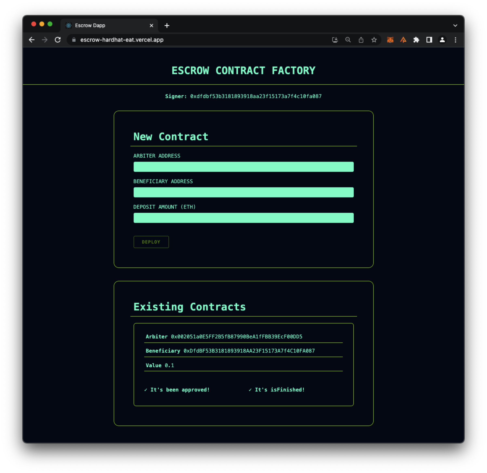

# Decentralized Escrow Application

[Alchemy University](https://university.alchemy.com) Week 5 final exercise by Eduardo Aire

## Overview

This DApp allows the user (deployer and arbiter) to deploy Escrow Smart Contracts by adding a beneficiary. Only the arbiter can approve the contract, and when this happens the beneficiary is allowed to withdraw the contract funds.
The app has the contract code and test, the frontend React App, and a server that allows persistent data to be retrieved in the UI.

## Content

1. Frontend - [`/app`](./app/)
2. Backend - [`/server`](./server/)
3. Escrow contract - [`/contracts`](./contracts/Escrow.sol)
4. Contract tests - [`/tests`](./test/)

### Local Configuration

-   Run `npm install` for hardhat dependencies
-   Run `cd app && npm install` for frontend dependencies
-   Run `cd server && npm install` for backend dependencies

## Hardhat

-   Configuration - [`hardhat.config.js`](./hardhat.config.js)

-   Compile contracts (artifacts will go to [`/app/src/artifacts`](./app/src/artifacts/)):
    ```Shell
    # With hardhat
    npx hardhat compile
    # With npm scripts
    npm run compile
    ```
-   Test contracts:
    ```Shell
    # With hardhat
    npx hardhat test
    # With npm scripts
    npm run test
    ```
-   Start local node:
    ```Shell
    # With hardhat
    npx hardhat node
    # With npm scripts
    npm run node
    ```

## Frontend

-   Start development host `npm start`
    -   At the root level it runs the [npm script `start`](./package.json) which runs `cd app && npm start`
    -   You can `cd app` and run `npm start` as well
-   Go to `http://localhost:3000`

## Backend

-   Start the express server `npm run server`
    -   At the root level it runs the [npm script `server`](./package.json) which runs `cd app && npm run dev`
    -   You can `cd server` and run `npm run dev` as well
-   The server's purpose is to provide persistent data to have easier access to the deployed contracts

## Live Demo

### [escrow-hardhat-eat.vercel.app](https://escrow-hardhat-eat.vercel.app/)

-   You can test the demo on any network supported by your browser wallet (tested with Metamask)
-   When you deploy a contract it will appear on the existing contracts card
-   When you approve the contract the beneficiary will be able to withdraw the funds
-   When the beneficiary withdraws the funds the contract will be marked as finished
-   Check a withdrawal on Sepolia https://sepolia.etherscan.io/tx/0xd86428fe63b1074ad125b03bde4d1937d172e20a3aef093d4df15c693f1facea
    
    
